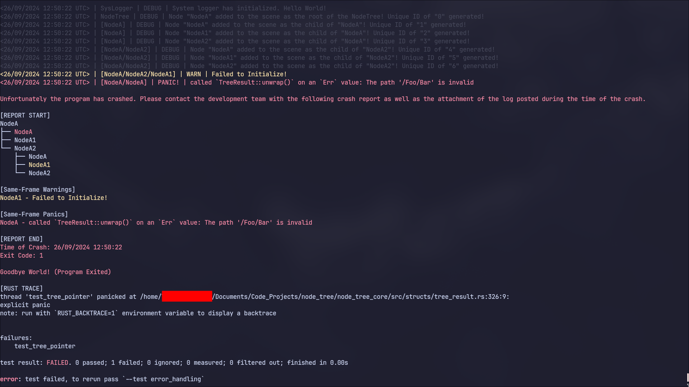

# NodeTree
[](https://github.com/LunaticWyrm467/node_tree)
[](https://crates.io/crates/node_tree)
[](https://docs.rs/node_tree)


**NodeTree** is a framework to create large scalable programs and games through a tree of processes. Each process is fully autonomous and is capable of storing its own state or data, and communicating with other processes. These processes are known as Nodes.

**⚠️WARNING⚠️**<br>
This crate is in early development. Beware of possible bugs or safety violations.<br>

## Getting Started!
Simply either run `cargo add node_tree` at the terminal directed towards the directory of your project, or add `node_tree = X.X` to your `cargo.toml` file.

To begin creating a program in Rust that utilizes a `NodeTree`, we must first create a root `Node`. In order to reduce boilerplate, we will use the included `Abstract` derive macro to implement the required `Dynamic` and `NodeAbstract` traits. We will then implement the `Node` trait ourselves.
```rust
use node_tree::prelude::*;


#[derive(Debug, Clone, Abstract)] // Nodes require `Debug` and `Clone`.
pub struct NodeA {
    base: NodeBase   // Required for Nodes.
}

impl NodeA {
    fn new(name: String) -> Self {
        NodeA { base: NodeBase::new(name) }
    }
}

// Example implementation of the Node trait with custom behaviours.
impl Node for NodeA {

    /// Runs once the Node is added to the NodeTree.
    fn ready(&mut self) {

        // To show off how you could add children nodes.
        if self.depth() < 3 {
            let new_depth: usize = self.depth() + 1;
            
            self.add_child(NodeA::new(format!("{}_Node", new_depth)));
            self.add_child(NodeA::new(format!("{}_Node", new_depth)));
            self.add_child(NodeA::new(format!("{}_Node", new_depth)));
        }

        if self.is_root() {
            println!("{:?}", self.children());
        }
    }

    /// Runs once per frame. Provides a delta value in seconds between frames.
    fn process(&mut self, delta: f32) {

        // Example of using the delta value to calculate the current framerate.
        println!("{} | {}", self.name(), 1f32 / delta);

        // Using the NodePath and TreePointer, you can reference other nodes in the NodeTree from this node.
        if self.is_root() {
            match self.get_node::<NodeA>(NodePath::from_str("1_Node/2_Node1/3_Node2")).to_option() {
                Some(node) => println!("{:?}", node),
                None       => ()
            }
        }

        // Nodes can be destroyed. When destroyed, their references from the NodeTree are cleaned up as well.
        // If the root node is destroyed, then the program automatically exits. (There are other ways to
        // terminate the program such as the queue_termination() function on the NodeTree instance).
        if self.children().is_empty() {
            self.free();   // We test the progressive destruction of nodes from the tip of the tree
                           // to the base.
        }
    }

    /// Runs once a Node is removed from the NodeTree, whether that is from the program itself terminating or not.
    fn terminal(&mut self) {}   // We do not do anything here for this example.

    /// Returns this node's process mode.
    /// Each process mode controls how the process() function behaves when the NodeTree is paused or not.
    /// (The NodeTree can be paused or unpaused with the pause() or unpause() functions respectively.)
    fn process_mode(&self) -> ProcessMode {
        ProcessMode::Inherit    // We will return the default value, which inherits the behaviour from
                                // the parent node.
    }
}
```

Finally, in order to activate our `NodeTree`, we must instance the root `Node` and feed it into the `NodeTree` constructor.
```rust
// ...previous implementations
use node_tree::trees::tree_simple::TreeSimple;


fn main() -> () {

    // Create the tree.
    let root: NodeA           = NodeA::new("Root".to_string());
    let tree: Box<TreeSimple> = TreeSimple::new(root, LoggerVerbosity::NoDebug);

    // Begin operations on the tree.
    while tree.process().is_active() {}
}
```

## Node Scenes
You may also input a `NodeScene` when initializing a `NodeTree` or adding a child via `add_child`:
```rust
use node_tree::prelude::*;


let scene: NodeScene = scene! {
    NodeA("Root") { // Nodes must have a constructor named `new()` in order for this to work!
        NodeA("1_Node") {
            NodeA("2_Node") {
                NodeA("3_Node"),
                    NodeA("3_Node"),
                    NodeA("3_Node")
            },
            NodeA("2_Node") {
                NodeA("3_Node"),
                NodeA("3_Node"),
                NodeA("3_Node")
            },
            NodeA("2_Node") {
                NodeA("3_Node"),
                NodeA("3_Node"),
                NodeA("3_Node")
            }
        }
    }
};

// Scenes can also be cloned, stored, and reused.
let _ = scene.clone();
```

## Logging
Logging is also supported. Here is an example setup with an output of a warning and a crash. Note that the crash header/footer are customizable, and that the output is actually colored in a real terminal.
```rust
use node_tree::prelude::*;
use node_tree::trees::tree_simple::TreeSimple;


#[derive(Debug, Clone, Abstract)]
pub struct NodeA {
    base: NodeBase
}

impl NodeA {
    fn new() -> Self {
        NodeA {
            base: NodeBase::new("NodeA".to_string())
        }
    }
}

impl Node for NodeA {
    fn ready(&mut self) {
        if self.depth() == 2 && self.name() == "NodeA1" {
            self.post(Log::Warn("Failed to Initialize!"));
        }
        
        if self.depth() == 1 && self.name() == "NodeA" {
            self.get_node::<NodeA>(NodePath::from_str("Foo/Bar")).unwrap();
        }
    }
}


fn test_tree_pointer() {
    let scene: NodeScene = scene! {
        NodeA {
            NodeA,
            NodeA,
            NodeA {
                NodeA,
                NodeA,
                NodeA
            }
        }
    };

    let mut tree: Box<TreeSimple> = TreeSimple::new(scene, LoggerVerbosity::All);
    while !tree.process().has_terminated() {}
}
```


## About Cloning
All nodes are expected to implement the `Clone` trait since there are a few implementations that depend on it, such as `NodeScene`. However, it is possible to mark a field of a node so that it either has a special clone attribute or is uncloneable via provided types by this crate:
```rust
use node_tree::prelude::{ Doc, Eoc, Voc }; // All of these types implement Deref & DerefMut!

#[derive(Debug, Clone, Abstract)]
pub struct SpecializedNode {
    base:   NodeBase,
    resets: Doc<YourUniqueTypeHere>,  // Grabs the ::default() of your type when cloned!
    errors: Eoc<YourUncloneableType>, // Panics when cloned! Good as an assertion.
    voids:  Voc<YourUnownableType>    // Doesn't panic when cloned, but the cloned copy is unusable.
}
```

## Features
- 🏗️ An easy abstraction framework for different processes to communicate and interact with each other in a scalable manner. Inspired by Godot!
- ⏯️ The ability to `pause()` and `unpause()` the `NodeTree`, and fine tune individual `Node` behaviours for when a tree is paused/unpaused.
- 📡 Various methods to communicate with other nodes, such as `owner()`, `parent()`, `get_child()`, `children()`, and `get_node()`.
- 🔗 An abstracted smart pointer known as `Tp<T>` and `TpDyn` which clones implicitly to reduce syntax noise and allows for low boilerplate.
- 📚 A caching system hosted on the `NodeTree` to act as a safe interface to ensure `Tp<T>`/`TpDyn` soundness, and increase performance!
- 👪 The ability to manage nodes with `add_child()` and `remove_child()`.
- 📝 Includes a dynamic logging and error handling system that is deeply integrated with the node framework.
- 🌲 Allows for the direct referencing of the `NodeTree` through a node's `root()` function.
- 📜 Includes a method to save (TODO) and handle individual node scenes, such as the handy visual macro `scene!`.
